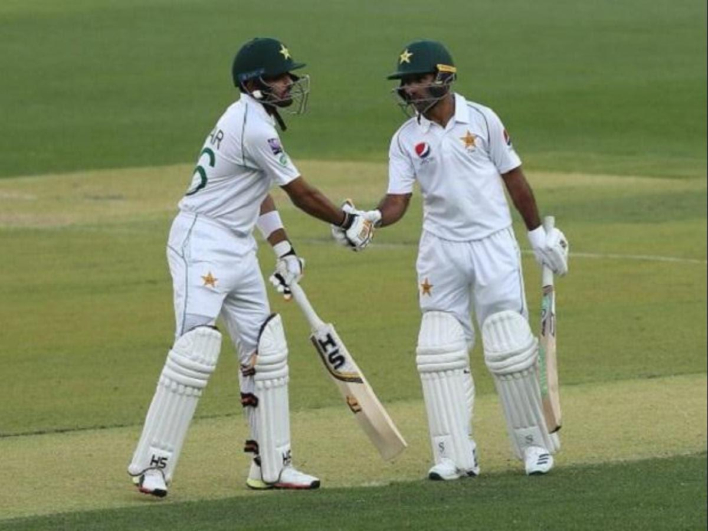
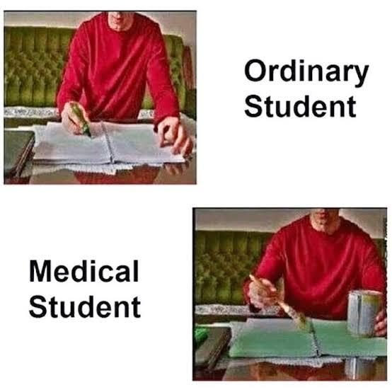
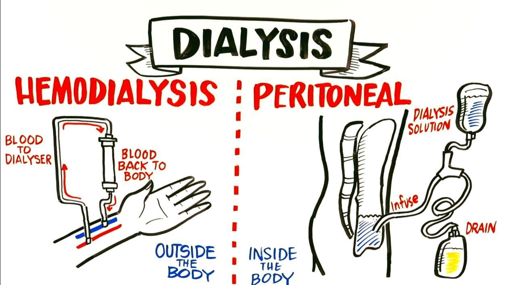
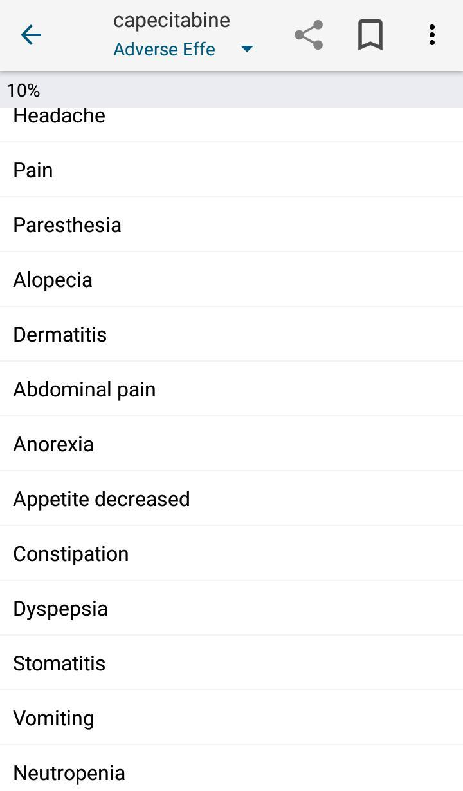
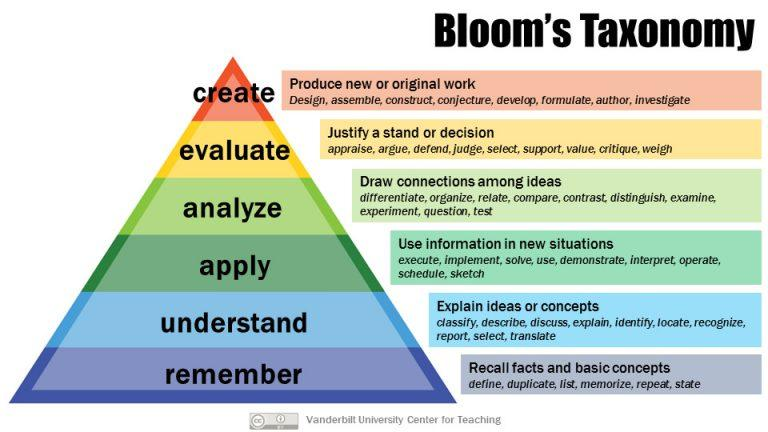
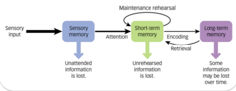

import './life-long-learning-strategies.css'

"Education is not something you can finish." - Isaac Asimov

Dr Raghav and Dr Rajni are two close friends who studied together in medical college. After graduating from MBBS, life has taken them on very different paths. But whenever they meet and share their         stories, they realise that they have been facing pretty much the same challenges! And one big mountain they climb on a regular basis is that of life-long learning. Let's see the 3 guidelines and 9 strategies these two doctors have developed to continually hone their skills.

<h3 class="c13">Guideline A: Develop and Feed Your Passion for Learning</h3>

Dr Raghav felt very demoralised by the low quality of teaching in his medical college, and was almost ready to quit medicine by the end of his internship, when his uncle invited him to join his established practice as an apprentice.

The way his uncle taught him, as well as learnt himself, was completely ground-breaking for Dr Raghav. He developed a new passion for learning and found that he really enjoyed being a physician! These are the three strategies he took away from that experience and he still uses them regularly! 

<h4 class="c2">Strategy #1: Link Learning to Your Passion</h4>

In the first few weeks of the apprenticeship, Dr Raghav's uncle asked him several questions about his likes, dislikes, and passions, and when he discovered Dr Raghav's passion for cricket, he started using a lot of cricket metaphors to drive home his points.

When Dr Raghav spent half an hour counselling a patient with newly diagnosed hypertension, his uncle praised him for putting in the effort, but also gently suggested to view hypertension management as a test match rather than a T20. The best strategy for a batting partnership in a test match is for the batsmen to settle down on the pitch and gradually build the score through ones and twos and the occasional boundaries.

In much the same way, a patient with recent-onset hypertension needs time to come to terms with their illness, to bring about the behaviour changes needed to manage their blood pressure, and to develop a lasting relationship with their doctor. It helps if the doctor is cool and relaxed, and happy with the slow and steady progress towards a perfect control of blood pressure through an ever-improving lifestyle!

Dr Raghav told this story to Dr Rajni, who said, "It's funny, a very similar thing worked for me too!" Dr Rajni had a baby just after MBBS, and had joined a distance learning course in maternal and child health. She was finding the course material extremely boring and uninspiring, and was about to drop out from the course, when some super-excited relative gifted a set of pastel colours meant for professional painters to their two month-old daughter!

Dr Rajni was reminded of her passion for painting, and started colouring the diagrams in the course material, and then making colourful notes herself using that colour set. That increased her retention of the course material, and she did so well in the exam that she topped her batch!

She has done several courses since then, and the colours have always helped her excel in every course.

<h4 class="c2">Strategy #2: Make it Fun and Enjoyable</h4>

Dr Raghav said, "The colour thing sounds fantastic. We had a classmate who used to colour all his books and notes with highlighters of 3 different colours. We used to laugh at him, but looking back now, he used to enjoy his study time much more than any of us did! I'm not an artist, but I can see how colours could make learning more fun."

Dr Rajni said, "Yes, and I found another way to make learning interesting. There are tons of videos on YouTube and elsewhere, on each and every topic under the sun! They're made by enthusiastic people whose love for the subject shines through in their teaching, plus they use lots of colourful diagrams, keep making jokes in between, and best of all, we can learn at our own pace!"

Dr Raghav said, "Yes, Khan Academy's videos are legendary. I watched this video on the electrical conduction system of the heart, and I've never looked at hearts the same way again! ([https://www.khanacademy.org/science/health-and-medicine/circulatory-system/heart-depolarization/v/electrical-system-of-the-heart](https://www.khanacademy.org/science/health-and-medicine/circulatory-system/heart-depolarization/v/electrical-system-of-the-heart)) I also find it interesting to learn from stories. My uncle has lots of patient stories, and when he isn't making terrible cricketing metaphors, he's sharing an exotic story about a patient who taught him something or the other!"

Dr Rajni said, "I agree, stories capture our imagination, and help us relate better to the learning material. Also, I find it very enjoyable to learn in a group! All the courses I've attended used to give us group assignments, engage us in group discussions, and the learning groups we formed are still alive to this day. We keep discussing interesting patients, latest articles and guidelines, and adding our collective experience to the evidence adds a lot of value too!"

On his way back home after this conversation, Dr Raghav is reflecting on their discussion, and decides to start doing more learning activities on their batch's WhatsApp group - after all, there should be more to a professional group than wishing each other on festivals and birthdays! But he also realises he enjoys discussing things in person much more than online. He decides to start a Doctors Club in his hometown, where a few FPs can meet regularly and focus on updating their skills and knowledge. He decides to start by sharing the most fun learning resources he's found and his most engaging patient stories in these groups! 

<h4 class="c2">Strategy #3: Start Teaching, Training, and Mentoring</h4>

Dr Rajni is also reflecting on their conversation, and remembers that during the courses, she was assigned a few topics to prepare and teach to the whole class, and she can recall them very vividly. Whenever she thinks of learning a new procedure, she can hear her surgery professor's voice in her head, "See one, do one, teach one", and she decides to start teaching, training, and mentorship of young doctors, and make them as passionate about learning as she is. 

In the next few days, she's toying with a few ideas: starting a YouTube channel, painting a colourful medical book, starting online group learning courses, etc. She's unable to travel as she's going through a complicated pregnancy. Then inspiration strikes: She's going to start a series of online video lectures, in which she's creating colourful medical notes on common topics! Once there are enough of such lectures, she can create a course around it, in which she will ask participants to create such colourful notes themselves, with her support and supervision!

She excitedly shares her idea with Dr Raghav, who says, "I'm going to be your first student, and then I'm going to enrol the whole of our Doctors Club in your course!" Dr Rajni says, "That's great! Give me some ideas for topics you'd like to learn!" Dr Raghav consults his Doctors Club, and they decide they want to learn a vast range of topics, from core clinical skills like confidently reading ECGs and methodically investigating anaemia, to communication skills like breaking bad news and smoking cessation counselling, to practice management topics like managing finances and improving quality of care and services in their clinics. Dr Rajni likes their list: the more variety in the learning topics, higher the fun quotient! 

Dr Raghav also decides to utilise every opportunity to educate, teach and mentor everyone around him: his patients and their families, his nurses and other staff, his neighbours and community. He's even started writing for newspapers, going on radio channels, and getting paid health talk assignments. His fun lecture on handwashing has become so popular that he's now fondly known as the Hand Wash Doctor in the whole town!  

<h3 class="c13">Guideline B: Make it Easy for Yourself to Learn</h3>

As their lives and practices get busier, both Dr Raghav and Dr Rajni realise that it takes a lot of effort to continually learn and keep abreast of the latest medical developments. Thankfully, over the years, they have developed techniques and tricks to incorporate the learning process in their daily routine. These are the 3 strategies that have worked for them. 

<h4 class="c2">Strategy #4: Bookmark Resources and Use them at Point of Care</h4>

Just the other day, Dr Raghav came across a challenging patient. This was a 67 year old lady he had seen several times before in his clinic. She complained of abdominal pain, nausea and loose motions for which she was taking Imodium. The pain was crampy, in lower abdomen, and relieved by passing motions, which were semi-loose 3-4 per day. 

She further shared that she was undergoing treatment for breast cancer. She was first diagnosed 6 years back, and got remission with surgery and chemotherapy at that time, but cancer had recurred 5 months back, and had metastasized, for which palliative chemotherapy was started with capecitabine and docetaxel.

Dr Raghav confessed to the patient that he didn't know about these medicines, and opened up Medscape app on his phone. He searched for capecitabine and in the Adverse Effects section he could find all the symptoms that the patient was complaining of. He also glanced at his favourite resource, the Scottish Palliative Care Guidelines, to see what pain medication would work best for her cramps. ([https://www.palliativecareguidelines.scot.nhs.uk/](https://www.palliativecareguidelines.scot.nhs.uk/)) He gently explained what all he had found to the patient and her husband, and prescribed medicines for symptomatic relief, fluids, and probiotics. He suggested them to contact their oncologist in case these treatments didn't give her relief. The family thanked him for his extra effort, and went away satisfied. 

Dr Raghav mentally thanked the creators of Medscape, his favourite point-of-care resource, which had greatly increased the range of conditions he could confidently manage. He decided to share his experience of Medscape in the next Doctors Club meeting, and ask other members what resources they've bookmarked on their phone or computer for looking up during consultation itself. He also resolved to get an UpToDate subscription soon, maybe as a birthday present for himself! 

<h4 class="c2">Strategy #5: PUNs = DENs</h4>

Even after doing everything he did for his patient, Dr Raghav had a nagging feeling that there could be more he could have done. Before calling in the next patient, he fired up the Notes app on his phone, opened the Note titled "PUNs" and added: "Management of chemotherapy-associated diarrhoea" at the top.

He had started keeping track of such points after attending a workshop in a conference where they taught the simple yet powerful concept of PUNs = DENs. Stated fully, Patients' Unmet Needs are equal to Doctor's Educational Needs. In other words, the doctor needs to recognise where they're not able to meet the needs of their patients, and gear up to gather the skills and knowledge needed to fulfill those needs.

While travelling by auto from clinic to home that night, Dr Raghav opens up the list of PUNs again on his phone, and reviews them. He finds that a common PUN in the last week in his clinic relates to the use of supplements in patients with osteoarthritis. He decides to educate himself about it.

From his previous learning experiences, he knows that books are unlikely to be helpful, as they would not incorporate the latest research of last few years. He searches on his trusted Medscape app and finds that "glucosamine-chondroitin and glucosamine or chondroitin sulfate alone show medium-term benefits with no long-term benefits for pain or function." 

There's no mention of curcumin, which some of his patients have been prescribed by other doctors. He tries a Google search, and it seems there's a lot of hype about curcumin for osteoarthritis. To dig deeper he opens and reads an article on this topic on the Harvard Health Blog. ([https://www.health.harvard.edu/blog/curcumin-for-arthritis-does-it-really-work-2019111218290](https://www.health.harvard.edu/blog/curcumin-for-arthritis-does-it-really-work-2019111218290)) After reading the article, it's clear that all the hype is just based on one small study. He decides to wait for more studies before he starts prescribing it himself, and if patients ask him about it, he can share with them what he's found today, in simple terms they can understand, and let them make up their minds whether they want to stop taking it or to continue. 

<h4 class="c2">Strategy #6: Learn from Everyone, Everywhere, All the Time </h4>

Dr Raghav still has a few minutes to reach home. He remembers the spirited discussion they had on the movie Drishyam in the last Doctors Club meetup. They discussed how doctors can use the power of positive imagery to challenge and change the negative narratives people have in their minds, about themselves, their family and their disease. 

Dr Vani, a new member of the club, shared how she uses this technique to counsel parents who complain in front of their children, "He/she doesn't eat any fruits or vegetables!" Dr Vani asks the child, "Which fruit do you like? I love apples, do you like apples too?" Typically the child says the name of one or two fruits and vegetables that they like, Dr Vani congratulates him/her on that, and continues to build on the positivity, finally suggesting parents to use positive imagery like enjoying fruits and vegetables in front of children to get them to eat healthier! Dr Raghav also tried this technique with his patients, and it seemed to work! 

In the coming meetup, he's looking forward to talking about this book he read last month "When Breath Becomes Air". The insights from this autobiography of a dying neurosurgeon will surely help the doctors change the way they take care of end-of-life patients, specifically, to help them find meaning in the last few days of their life. In fact, in recognition of the multiple roles a Family Physician plays, the Club has started devoting the first 15-20 minutes of their meetup to discuss an art piece, and how they can use the lessons to change the way they practice the Art of Medicine. This includes paintings, sculptures, movies, short films, Ted Talks, poems, hymns, novels, etc etc. They even discussed learnings from a Saas Bahu serial once! 

With that thought, Dr Raghav looks outside the auto and realises that learnings are everywhere around us! We can learn customer service from our friendly neighbourhood chai wallah, discipline from the milkman, playfulness from young children, IT skills from the nerdy cousin, social media strategies from our competition, and how to brave adverse environment from the plants and trees growing in our yard! 

<h3 class="c13">Guideline C: Learn Effectively When You Learn</h3>

It seems to Dr Rajni that the more she learns and teaches, the more she realises how much more there is to the teaching and mentorship process. She's very much appreciative of all the teachers in her life who not only made the learning fun but also long-lasting. Now that she's a teacher herself, she makes sure to incorporate these three strategies below to enhance the effectiveness of the learning process. 

<h4 class="c2">Strategy #7: Small Frequent Feeds</h4>

In the initial days of teaching, she used to frequently encounter glazed eyes within 10 minutes of her starting to speak on a particular topic. She discussed this with Dr Raghav, who said, "Here comes my uncle's cricket metaphor: There's a reason why an over is only 6 balls, and the bowlers and batsmen have to change at the end of the over. Efficiency decreases if we overload our senses." Dr Rajni said, "So you're saying I might be giving them too much information?" Dr Raghav said, "Could be, after all most of us can only hold and process maximum 3 concepts in our brain at one time!" 

Dr Rajni reflected and agreed that in her zeal of teaching, she was overloading her slides with learning material. She started reducing the content on each slide, breaking the concepts into smaller chunks, and voila! her students were much more attentive and engaged since then! She uses the same technique on herself now, reading up a topic in bits and pieces, taking time to digest and reflect and only then reading further. 

<h4 class="c2">Strategy #8: Climb Up Bloom's Taxonomy</h4>

Dr Rajni has another technique to prevent students turning to their mobile phones while in her class. Before each session, she reflects on the background of her learners, where they're practicing and how they're going to use the learnings from her session. She then defines 1-3 specific learning objectives (SLOs) for her session, and they help her to make the material super-focused, and to keep the attention of the class throughout the session!
    
She recently came across a very interesting paradigm called Bloom's Taxonomy and she's started using it to create these SLOs. If most of her students have crossed the "Remember" and "Understand" levels, then she creates the objective around "Applying" the concepts to solve real-life problems. E.g. applying an algorithm to rationally investigate anemia in patients. Once this is defined, it's very clear that she doesn't need to focus on explaining the algorithm itself, rather on taking the participants through various patient scenarios and applying the algorithm to rationally investigate each patient. 

This same technique she uses to better define her DENs every week, and choose the learning strategy that best fits that need. If she needs to remember something, she uses mnemonics, flash cards, vivid imagery and of course, her favourite tool, painting with colours, to enhance the chances of the material sticking in her mind. 

And she strives to climb ever higher on the taxonomy ladder! 

<h4 class="c12">Strategy #9: Reflect, Revise, Rehearse</h4> 

"This last strategy can't be repeated enough!" Dr Rajni chuckles to herself, and vows to never subject her students to this terrible PJ. She does however recall several lectures and courses that repeated their key take home message again and again in various different ways. She specifically remembers an engaging lecture she attended on recent advances in diabetes, and the faculty kept repeating, "Be obsessed about blood pressure!", after every 3 slides, driving home the point that strict control of blood pressure is now considered much more important for the long term health of a diabetic than strict control of their blood sugar. 

That lecture changed her practice - she and her clinic staff now regularly measure and strictly manage her diabetic patients' blood pressure. And it also changed her teaching. She keeps reiterating the key message throughout the session - in much the same way fans keep asking the score during a cricket match! 

She also encourages her mentees and students to reflect on the day's learnings, and think about how they'll change their practice in the future, before finishing the day's work. And she follows the same practice herself, spending 10 minutes every night reflecting and revising the day's learnings, after putting her kids to sleep. Any memory that's revised within 24 hours has a much higher chance of getting stored in the long-term memory.

<h3 class="c16">Endgame</h3>

If you've read through this whole article and reached here, I salute you! Can I keep your interest for another two minutes so that we can cement the learnings from this article?

Here's a treasure hunt: Out of the nine strategies presented in the article, which strategies have been followed in this article, and which have not? You can keep your answer to yourself, or you can send your answer to me, along with any feedback about this article or even general comments on learning strategies.

* Email:  [devashish@rossclinics.com](mailto:devashish@rossclinics.com)
* WhatsApp:  +91-9990505859
