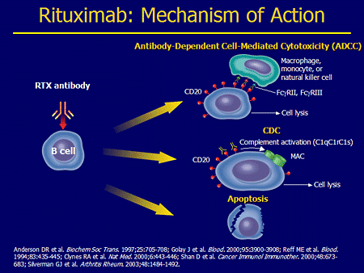
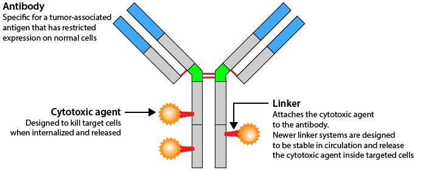
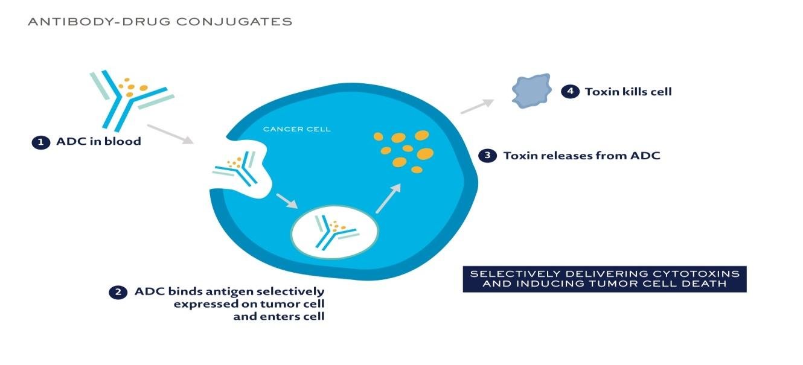
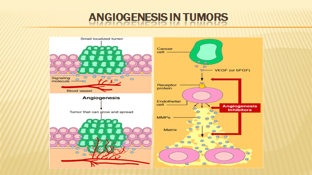
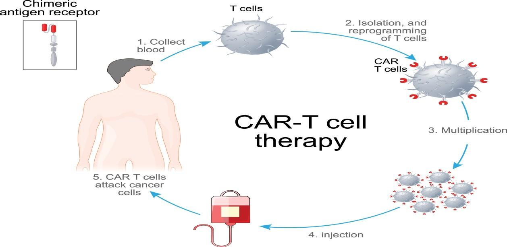
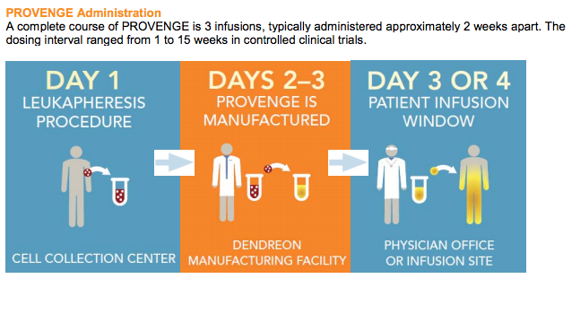

import './paradigm-shift-in-cancer-management.css'

National Cancer Institute defines molecular therapy in cancer treatment as substances that kill cancer cells by targeting key molecules involved in cancer cell growth.

The need for targeted therapy in cancer was realized long back when undesirable side effects of chemotherapy were seen. This was a dream of having a treatment specifically directed towards functionality at level of cancer cell with minimal toxicity to normal host tissues. Paul Ehrlich’s vision of “magic bullet” in cancer therapy is being realized now.

Cancer cells are recognized to have specific antigenic and molecular receptors as the starting point for a cascade of events leading to cell division, and specific enzymes triggering cell division and angiogenesis.  Most of the molecular therapy measures are directed against these targets.

Targeted therapy includes two arms – what to target and how to target ( receptor function and delivery function).  It encompasses several classes of agents like monoclonal antibodies and tyrosine kinase(TK) inhibitors.   Molecularly targeted therapy has used both small molecules to directly inhibit these TKs and monoclonal antibodies to indirectly affect the pathways these TKs control.

Cancer care has advanced in the last decade in leaps and bounds by improving treatment, early detection and prevention.  

Traditional chemotherapy looked at killing the cancer cell directly as a bombing action.  Newer agents kill cancer cells like missile action, targeting only the cancer cells, though there are some associated side effects on normal cells.  

Newer agents can be classified into two -

* **Targeted therapy** - may either attack tumor cells directly or, by stimulating the immune system, target them indirectly. If we look at the genetic make up of the tumor regardless of the site of tumor, and give treatment targeted according to the unique molecular profile of the malignancy, it is known as precision medicine or personalized medicine.  This complex but unique molecular profile can be studied now, by tests known as Next generation sequencing.

* **Biological therapy** – Biological therapy involves the use of living organisms, substances derived from living organisms, or laboratory-produced versions of such substances to treat disease  

### Targeted therapy 

The era of personalized medicine actually started many years back when the drug Tamoxifen was used to treat Estrogen receptor positive breast cancer cells.  However it was much later that the knowledge of the biological functioning of a cell was understood and many targets identified.  The first drug of this era was Imatinib in 2001, which targeted the bcr-abl oncogene which resulted due to Philadelphia chromosome in patients with Chronic myeloid leukemia.  The BCR-ABL chimeric fusion protein  causes tyrosine kinase activity which causes uncontrolled cellular proliferation, which was inhibited by Imatinib.  This drug has stood the test of time and has made it possible for many patients of Chronic myeloid leukemia to enjoy long term survival, and possible cure for a small subset of patients. 

Such drugs are known as “small molecule tyrosine kinase inhibitors”.  These drugs may interfere with a specific protein function, which has Tyrosine kinase activity which causes uncontrolled cell proliferation.   These drugs are not derived from biologic sources and hence do not come under classification of biological therapy or immunotherapy.

Some examples of small molecules interfering with intracellular signal transduction:

**Against EGFR (epidermal growth factor receptor)**

Erlotinib, Lapatinib (dual), Gefitinib

**Against VEGFR (vascular endothelial growth factor receptor)**

Sorafenib 

**PDGFR  (platelet derived growth factor receptor)**

Imatinib, Sunitinib, Afatinib

Examples of some drugs and their use :

<table cellspacing="0" cellpadding="0">
    <tbody>
        <tr>
            <td class="s0">INN</td>
            <td class="s1">Indication</td>
        </tr>
        <tr>
            <td class="s2" colspan="2"><strong>Tyrosine kinase inhibition</strong></td>
        </tr>
        <tr>
            <td class="s3">imatinib </td>
            <td class="s4">CML, GIST </td>
        </tr>
        <tr>
            <td class="s5">dasatinib</td>
            <td class="s6">CML</td>
        </tr>
        <tr>
            <td class="s5">gefitinib</td>
            <td class="s6">NSCLC, ORL</td>
        </tr>
        <tr>
            <td class="s5">erlotinib</td>
            <td class="s6">NSCLC</td>
        </tr>
        <tr>
            <td class="s3">semaxanib</td>
            <td class="s4">Colorectal Ca </td>
        </tr>
        <tr>
            <td class="s3">lapatinib </td>
            <td class="s4">RCC, Breast Ca, H + N </td>
        </tr>
        <tr>
            <td class="s5">sorafenib</td>
            <td class="s6">Liver Ca</td>
        </tr>
        <tr>
            <td class="s2" colspan="2"><strong>Proteasome inhibition (multi catalytic protease complex)</strong></td>
        </tr>
        <tr>
            <td class="s5">bortezomib</td>
            <td class="s6">Multiple myeloma, NHL</td>
        </tr>
    </tbody>
</table>

Another fine example of targeted therapy associated with a specific genetic mutation is seen in patients with breast and ovarian cancers.  It has been found that BRCA gene is mutated in a minority of patients with ovarian and breast cancer.  Now BRCA gene is actually a tumor suppressor gene which helps in repairing damaged DNA (double stranded DNA breaks) by error free homologous recombinant repair.  If BRCA gene is mutated, it is unable to perform its function of DNA repair.  This is where an enzyme named PARP - Poly (ADP-ribose) polymerase, a family of proteins involved in a number of cellular processes such as DNA repair comes into play.  PARP is a protein that is important for repairing single-strand breaks.  Now if BRCA is mutated, then PARP comes and repairs the damaged DNA in cancer cell.  If this PARP is inhibited, then the DNA in cancer cell has no way to repair itself and it dies. The PARP inhibitors used in treatment of BRCA mutated ovarian and breast cancers are Olaparib, Talazoparib.  They have been used in various settings – first line, second line or even third lines of therapy of BRCA mutated cancers of ovary.  Besides cancers of breast and ovary, BRCA mutations have been seen in Prostate and Pancreatic cancers and these drugs have been used in them.

### Biological therapy

This involves usage of an antibody against a target antigen seen on the tumor cell.  Since the antibodies are made in laboratory using living organism, they are known as biological therapy.  Also as this involves an antigen-antibody interaction, they are also known as immunotherapy.  

#### Terminology of monoclonal antibodies

**Murine** monoclonal antibodies – high production of HAMA; generic ending: **-mab**. 

**Chimerical** monoclonal antibodies – 60–70 % of human protein (constant domains) + 30–40 % murine antibodies; generic ending: **-ximab**. 

**Humanized** monoclonal antibodies – 5–10 % murine antibodies; generic ending: **-zumab**

**Human** monoclonal antibodies (100% human); generic ending: **-mumab**

Immunotherapy is again of several types:

1. Identifying target antigen on cancer cell and an antibody produced against it – eg Anti CD 20 antibody Rituximab for CD 20 positive B cell lymphomas, anti Her 2 neu antibody Trastuzumab for Her 2 neu positive breast cancer.

Also now, antibody drug conjugates are available – in which the antibody is linked to a cytotoxic drug.  The presence of antibody helps in gaining entry of the conjugate into the cancer cell, and once it enters, the drug is released inside the cancer cell, where it can disrupt various cell functions killing the cancer cell.  Drugs available are Ado –trastuzumab (Her 2 neu positive breast cancer), Brentuximab vedotin (CD30 positive Hodgkins lymphoma).

2. Immune check point inhibitors – this is the most recent development in treatment of cancers.  It has been long understood that our immune system, especially T lymphocytes, has the capability of identifying and killing cells “foreign” to the body.  The immune system is however kept under check by “check point inhibitors” as the T lymphocytes can also mount an auto immune “response which is detrimental to body.  In many diseases including cancers, this ability is lost due to multiple reasons.  One such proposed reason is that the cancer cell has suppressors which suppress the T lymphocytes.

3. Targeting tumor angiogenesis –As the cancer cells increase in size and number, they eventually require their own blood supply to keep them growing.  They do so by secreting cytokines which results in neo-angiogenesis.  It has been in scientific experiments since many years that if the tumor could be somehow starved, it will not grow.  A lot of work was carried on by Dr Judah Folkman in this field.  Bevacizumab is a humanised recombinant antibody that prevents vascular endothelial growth factor (VEGF) receptor binding, and inhibits angiogenesis and tumour growth. 

4. CAR (chimeric antigen receptor) T cells where there is reprogramming and expansion of a T cell clone in vitro which is then injected back into the host, where these T cells then kill the cancer cell – activity seen in lymphomas.  

5. Vaccine therapy – sipuleucel-T is an FDA approved personalized therapy against prostate cancer.  It can activate patient’s own immune system to seek out and attack advanced prostate cancer.  First the patient’s blood is run through a pheresis machine when some of the patient’s immune cells are collected. These immune cells are then exposed to a protein intended to stimulate and direct them against prostate cancer. Following this exposure, the activated immune cells are then returned to the patient to treat the prostate cancer.  In addition to the antigen presenting cells, it also contains T cells, B cells, natural killer (NK) cells, and other cells. 

These are some of the new advances which have changed our mindset towards treating cancer.  Looking into the future, all malignancies will be assessed for targets and genetic mutations and treated accordingly.    
