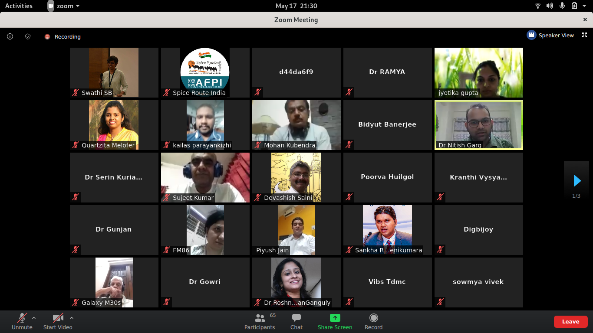

On the occasion of World Family Doctors’ day, young family doctors from across the country met to share their experience providing Primary Health Care during the challenging situation of the current pandemic. This event was organised by the Spice Route India Movement with the leadership of Dr Serin Kuriakose, Dr Jyotika Gupta and Dr Kailas P, Dr Mohammed Idris and state leads on the 17th of May, 2020 from 9:00 - 11:00 pm. 

This also marked the pleasant inauguration of the Spice Route India website by Col. (Dr) Mohan Kubendra. Link to the website :  https://spiceroute.afpikerala.in/

More than 70 doctors participated in the cafe and family doctors from 11 states shared their experience in caring for families during COVID-19. Participants were from across the states and included senior physicians like Dr BC Rao and young physicians as well. Experiences shared varied from running private clinics with precautions and using tele-medicine as a strategy to management of patients in hospital settings where patients with COVID 19 infection are cared for.    

Dr Piyush Jain shared about the challenges and shifts in thinking and practice that has happened in caring for people with chronic illness and non-communicable diseases. 

It was refreshing to take a pause and reflect on our practices, emotions that our patients and ourselves are going through, and what to expect going forward. It also brought the sense of  collective learning and togetherness among the warriors in the current battle. 
