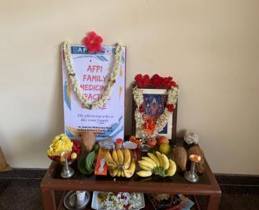
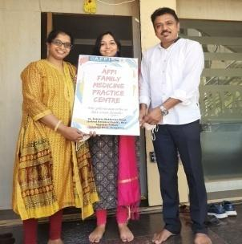
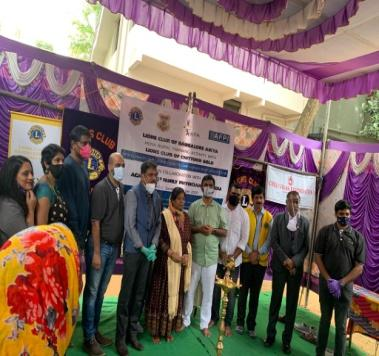
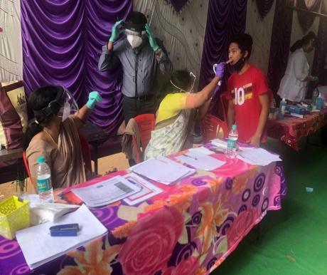

1. Conducted a webinar on “ Training of family physicians in Practice management during COVID” by invitation from the prestigious Rajiv Gandhi University Of Health Sciences at their campus on 27 th April. Four relevant topics were covered- a.  Role of GPs during COVID 19 pandemic and the related infodemic- By Dr Mohan Kubendra, teleconsultation and triaging of patients in a clinic- By Dr Roshni Jhanganguly,  Clinic management and well being of GPs during COVID- By Dr Swapna Bhaskar and PPEs for GP and role of GP in community prevention of COVID – By Dr Sowmya Vivek. The webinar was attended by a good number of GPs practicing all over Karnataka who immensely benefitted from it . The coveted university members also gave a very positive feedback of the program.  

2. AFPI Karnataka members Dr Swapna Bhaskar and Dr Sowmya Vivek were the panelist and speakers for a webinar conducted by Family Physicians Association of India- Bangalore Chapter on the topic – “ Clinic management and use of PPEs for Family Physicians” – May 10 , 2020.

3. Conducted the first webinar on “Management of COVID patients by family physicians “ on 13 th August 2020 via zoom platform. The webinar was a huge success with participation from all over India. 

4. The first year of the AFPI- Karuna Trust family medicine fellowship program culminated with the successful certification of Dr Rajeshwari . She was awarded the certificate at the Karuna Trust Head office at Jayanagar Bangalore in the presence of Dr Sudarshan – the chairman of the trust. The current year has 5 aspirants who have joined the fellowship program .

5. The MOU between AFPI and St Johns’ Academy of Medical Sciences for “FFM- Fellowship in Family medicine” was signed in July 2020. There are 30 applicants for this year and the program has started successfully. 

6. The first collaborative family practice clinic was started  in the premises of “ Canara Diagnostic Center” in Bangalore. The clinic is named “AFPI Family  Medicine Practice Centre” with the tag line – “ The Physician who is like your family” . Two physicians are currently in practice there and we plan to expand such clinics to other centers too . The inauguration of the clinic was done by the vice president of AFPI Dr Mohan Kubendra on August 29 th after a small pooja. Dr Gowri and Dr Suzi are currently the practitioners there catering to patients on all days.

7. RGUHS – meeting with RGUHS senate member Dr Jaikrishna was done in May and the proposal for expanding MD family medicine to other colleges under the university was accepted. The further steps are put on hold temporarily due to the COVID pandemic and we hope to pursue it as early as possible. 

8. Due to the pandemic the hands on workshop  on PVD has been indefinitely postponed and we plan to do it as early as possible. 

9. October 17 2020- webinar on the topic “ palliative care for primary physicians during COVID crisis “ was done via zoom platform . Dr Archana Sampath, Dr Ashoojit, Dr Prathamesh Sawant and Dr Manoj spoke on the latest updates on palliative care,  home management and end of life care.   

10. Conducted the first of its kind webinar for the public on “child development” to commemorate the child rights and safety week. Dr Gowri Chintalapalli spoke on the subject and the webinar was moderated by Dr Jaya Bajaj. The program was aired live on AFPI Karnataka Facebook page and well appreciated by the participants. 

11. FFM training program by St John’s academy has 30 registered candidates  this year and AFPI members are actively participating in the conference call programs. The first one on “ common opthal problems in GP” was moderated by Dr Sowmya Vivek in September. The second one on “ common ENT problems in GP” was moderated by Dr Swapna Bhaskar . the third one on “ common case scenarios in pediatrics” was also moderated by Dr Swapna Bhaskar. 

12. A webinar on “ Co-morbidities in COVID and post COVID complications in family practice’ was conducted on 28 November.  The session was moderated by Dr Syed Mubarak ; the speakers were Dr Sanjay A S and Dr Srividhya Raghavendra. 

13. AFPI Karnataka in association with the Lions Club and AIKYA conducted a free health check and juvenile diabetes detection camp for the residents of the Sri Sai Sneha Samaste Foundation orphanage at Kanakapura road on 6 th December 2020. Dr Mohan Kubendra, Dr Gowri C and Dr Supreetha Mithun participated and gave talks on general well being and good habits to all the residents. AFPI plans to do more such camps after the warm reception and encouragement received by this.  

14. A webinar on “Adult vaccination “was conducted on 15 the December through zoom. Dr Swapna Bhaskar spoke on the subject and the session was moderated by Dr Sowmya – head of academic wing AFPI Karnataka. 
