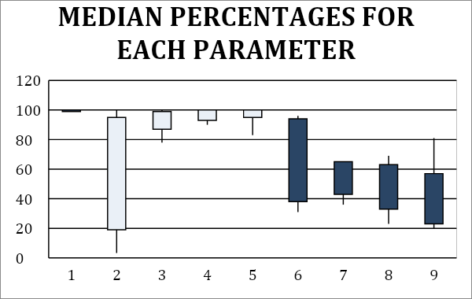

### ABSTRACT

**BACKGROUND**: Diabetes mellitus (DM) is a major public health problem with a drastic rise in prevalence during the past decade. India is now referred as “the diabetic capital” of the world due to the exponential increase in number of cases. Long standing diabetes can affect multiple organ systems leading to numerous micro and macrovascular complications like renal failure, blindness, heart disease etc. Hence there is an urgent call for action regarding the care and follow up of all diabetic patients.

**Objective**: To assess the level of management, any lacunae in screening, and follow up for complications among type 2 diabetes mellitus (Type 2 DM) patients in the outpatient department of a tertiary care hospital.

**METHODS**: A cross-sectional study was conducted in a referral teaching hospital in December 2018. 254 patients with type 2 diabetes mellitus without any prior complications were randomly selected for screening as per the criteria developed by RSSDI [Research Society For the Study of Diabetes in India].

**RESULTS**: This audit showed that complete history and examination was done in 100% of the participants. Measurement of blood pressure at every visit was done in about 95% of patients and 90% of them were counselled for cessation of smoking. Only about 50% of patients were screened for microalbuminuria, checked for peripheral neuropathy and given comprehensive foot care. 

**CONCLUSION**: This clinical audit showed that 4 out of 9 parameters involved in diabetic care were done in above 90% of patients, while the remaining varied between 40% and 60%.Thus emphasis has to be given for the subtle but important parameters like ophthalmic examination, peripheral neuropathy and microalbuminuria.

**Keywords**: Diabetes care, Macrovascular, Microvascular complications, Clinical audit.

### INTRODUCTION

Clinical audit is defined as “the systematic review of elements of clinical care against predetermined criteria, with the aim of identifying areas for improvement and then developing, implementing and evaluating strategies intended to achieve that improvement.”[^1] The steps of a standard clinical audit are described in Box 1.

[^1]: NICE. Principles for Best Practice in Clinical Audit. Oxford, Radcliffe MedicalPress, 2002; p:1-2

**Box 1: The audit cycle**

* Preparing for audit
* Comparing with a standard criterion
* Measuring performance
* Data analysis
* Implementing changes

As per statistics from the International Diabetes Federation (IDF) 2019,India is home to the second largest number of adults living with diabetes worldwide, affecting a wide age group of between 20-79 years. As per the data, prevalence of diabetes has increased over the past 13 years with exponential increase in mortality due to complications associated with diabetes. [^2]

[^2]: Mortality attributable to diabetes in 20–79 years old adults, 2019 estimates: Results from the International Diabetes Federation Diabetes Atlas, 9th edition

Current estimates peg the number of diabetics in the country at about 62 million; an increase of over 10 million from 2011.

Several studies reported high prevalence of diabetes, especially of undiagnosed cases amongst the adult population, most of whom have uncontrolled blood sugar levels. It is also proven that premature mortality and morbidities due to  complications of DM impose a significant economic impact for individuals and their families, as well as the country’s  healthcare.[^3],[^4]

[^3]: Jaya Prasad Tripathy, J. S. ThakurGursimer Jeet, Sohan Chawla, Sanjay Jain, Arnab Pal,  Rajendra Prasad and Rajiv Saran. Diabetology & Metabolic Syndrome2017; 9:8
[^4]: Maahs DM, West NA, Lawrence JM, et al. Epidemiology of Type 1 Diabetes. Endocrinol Metab Clin North Am 2010; 39: 481–97; DOI:2010.05.011.

Poor glycemic control is responsible for micro and macrovascular changes and can predispose diabetic patients to other complications.

A recent international study reported that diabetes control in individuals worsened with longer duration of the disease; neuropathy being the most common complication, followed by cardiovascular, renal, retinal problems  and foot ulcers.[^5]

[^5]: Mohan V, Shah S, Saboo B. Current glycemic status and diabetes related complications among type 2 diabetes patients in India: data from the A1chieve study. JAPI (Suppl) 201361:12–15

This indicates the need for systematic screening and awareness program to identify the undiagnosed cases in the community. They should be offered early treatment, regular follow up for detection and prevention of complications.

RSSDI is an Indian committee created for care of Diabetes and is the largest organization for diabetes health care professionals and researchers in Asia. The committee recommends 9 parameters for routine monitoring as a standard of diabetic care which has been adopted in this study.

Other organisations like WHO also recommend Diabetic care programmes [^6] for the surveillance, prevention and control of diabetes and its complications, particularly in low- and middle-income countries.

[^6]: Definition, Diagnosis and Classification of Diabetes Mellitus and its Complications. Part 1: Diagnosis and Classification of Diabetes Mellitus (WHO/NCD/NCS/99.2). Geneva: World Health Organization; 1999.

**Why are Indians Highly Susceptible to Diabetes?**

A number of factors in combination make Indians highly susceptible to Diabetes. [^7]

[^7]: Mohan V Why are Indians more prone to diabetes? J Assoc Physicians India. 2004 Jun;52:468-74.

1.  Genetic factors are among the greatest contributors to the rapid spread of this disease. On an average, Indians are four times more likely to develop diabetes than Europeans, based solely on genetic outlook.

2. Cultural and social factors also play an important role. The Indian diet is rich in carbohydrates and saturated fats. A typical Indian diet has more calories and sugar than required by the body, causing obesity, which in turn leads to diabetes.

3. Urban migration and change in lifestyle is another factor that must be considered in India. With rising standard of living, comes the tendency to lead a sedentary life and consume processed sugary foods.

There is now sufficient evidence of an “Asian phenotype” in diabetes.[^8] The Asian diabetic patient is characterised by an onset at a younger age, higher risk even at lower body mass index, higher abdominal adiposity, higher cardiovascular disease in South Asia, and stroke in East Asia. These typical characteristics must influence the choice of treatments that are available for such patients.

[^8]: Lim LL, Tan AT, Moses K, Rajadhyaksha V, Chan SP. Place of sodium-glucose cotransporter-2 inhibitors in East Asian subjects with type 2 diabetes mellitus: Insights into the management of Asian phenotype. J Diabetes Complications. 2017;31:494–503.

### AIMS AND OBJECTIVES

This audit was done to understand management of diabetes beyond control of blood sugars, and to look for lacunae in the screening for preventable complications.

### MATERIALS AND METHODS

This cross – sectional observational study was done from December 1st to December 31st 2018. Patients’ folders were randomly selected for review and nine clinical parameters as per the guidelines [^9] were selected for the audit that included:-

* Complete history and Physical examination annually,
* Ophthalmic examination-every 2 years,
* Counselling for smoking cessation-every visit,
* BP measurement-every visit,
* Lipid Measurement-at diagnosis, at age 40 & 6th monthly.
* Screening for CVD (not conventionally recommended)
* Microalbuminuria-at diagnosis and annually, 
* Assessing for distal peripheral neuropathy-at diagnosis and annually,
* Providing comprehensive foot care-at diagnosis and annually.

[^9]: V Mohan, R Deepa Prevention of Complications of Diabetes, RSSDI Textbook of Diabetes Mellitus Second Edition; p:1180-11

Each physician from the department of medicine and family medicine was referred to as “units” with numbers allotted to them on a random basis.

Inclusion criteria: All patients between 18-65 years of age diagnosed with more than one year of Type 2 diabetes.

Exclusion criteria:

* Diabetic patients with life threatening acute illnesses 
* patients with type 1 diabetes mellitus 
* patients already diagnosed with DM related complications
* Gestational diabetes.
* Patients with less than 1 year of diabetes -as most of the criteria adopted from RSSDI required yearly follow up.

Descriptive statistical analysis was carried out. The mean percentage values of the nine medical units achieved per diabetic parameter were calculated and tabulated.

### RESULTS

The diabetic care given by each medical unit for each parameter in percentage is described in Table 1.

**Table 1: Results from the audit expressed in percentages.**

|Consultant / Unit|1|2|3|4|5|6|7|8|9|Total|
|--- |--- |--- |--- |--- |--- |--- |--- |--- |--- |--- |
|Parameters*|||||||||||
|Complete history and Physical annually|100|100|100|100|100|100|100|100|100|100|
|Ophthalmic examination-every 2 years|36|81|40|100|87|26|6.3|100|3.3|57.1|
|Smoking cessation-every visit|94|100|88|95|92|78|94|100|93|93.3|
|BP measurement-every visit|97|100|96|90|100|100|100|100|100|98.4|
|Lipid Measurement-at diagnosis, at age 40 & 6monthly|97|100|92|100|100|96|100|100|83|96.5|
|Screening for CVD|70|83|48|65|61|35|31|97|33|61.4|
|Microalbuminuria-at diagnosis and annually|61|44|52|60|66|39|63|67|37|54.3|
|Distal peripheral neuropathy-at diagnosis and annually|48|64|36|60|50|30|50|70|23|48.8|
|Comprehensive foot care-at diagnosis and annually|42|36|36|40|42|26|31|82|20|40.9|

*Parameter achieved in percentage

[View table in new window](/volume-4/issue-3/clinical-audit-of-diabetes-management-table-1/)

The results showed100% score in complete history and examination, 98.4% in blood pressure measurement , 96.4% in following up of lipid profile and 93.3% in counselling for smoking cessation at every visit. The score for the screening for cardiovascular system with a routine electrocardiograph was 61.4% in the study and that for ophthalmic examination with a fundoscopy was 57.1%. Screening for microalbuminuria at diagnosis and annually was done only in 54.3% of patients. Lastly, checking for peripheral neuropathy and comprehensive foot care scored a dismal 48.8% and 40.9% respectively.

---

Figure 1: Box plot graph of median percentages achieved for each parameter. The graph shows percentages on y-axis and x-axis describes the nine parameters numbered from 1 through 9. The lower limit of box plot represents the minimum level of performance and the upper limit being the maximum level of performance. For example in the first plot- the upper limit and the lower limit are at 100% as all the physicians have performed the first recommendation at a level of 100

---

### DISCUSSION

Lack of follow up and poor compliance with management can hasten the disease process in diabetic patients and there needs to be a meticulous screening system to reduce the incidence of end organ damage.

RSSDI recommends 9 parameters as the standard of care in clinical monitoring of type 2 diabetic patients. This study showed that 4 parameters were well addressed but the remaining were ignored by some of the treating physicians.
The proposed reasons for the above results could include:

1. Less doctor – patient time due to large number of patients seen by a physician per day.
2. Patients refusing few investigations because they are asymptomatic or having financial constraints.
3. Lack of a dedicated diabetic clinic in the outpatient department.
4. Common OPD history sheet with no specific columns for those parameters that need to be routinely evaluated in a diabetic patient. 
5. Lack of a standard protocol for a systematic follow-up as each physician followed different protocols.

The ADA [American Diabetic Association]recommends evaluating sleep pattern and duration as a part of the comprehensive medical evaluation in diabetics based on emerging evidence suggesting a relationship between sleep quality and glycemic control. An expanded list of diabetes co morbidities now includes autoimmune diseases, HIV, anxiety disorders, depression, disordered eating behaviour, and serious mental illness.[^10]

[^10]: American Diabetes Association standards of medical care in diabetes—2017; p 101

National Institute for Health and Care Excellence along with American Association of Clinical Endocrinologists and American College of Endocrinology have recommended several guidelines ensuring the same.[^11]
It was also found that level of patient satisfaction may enhance treatment compliance. [^12] Hence psychosocial and economic factors also need to be considered on initiation and follow up of the therapy.

[^11]: Amir Qaseem, MD, PhD, MHA et al, Hemoglobin A1c Targets for Glycemic Control With Pharmacologic Therapy for Nonpregnant Adults With Type 2 Diabetes Mellitus: A Guidance Statement Update From the American College of Physicians; Annals of Internal Medicine. 201803
[^12]: Mukherjee AK, Reddy VS, Shah S, et al. Quality of life as a key indicator of patient satisfaction and treatment compliance in people with type 2 diabetes mellitus in the IMPROVE study. J Indian Med Assoc. 2009;107:464–70.

In 2012, a clinical audit was conducted on diabetes management in a resource-limited primary care setting in Cape Town, South Africa. The study showed the baseline medians for six out of nine processes were below 50%. Co-interventions introduced after the baseline audit was found to have contributed to improved out- comes. In addition, support from the relevant government health programmes and commitment of managers and frontline staff contributed to the audit’s success. [^13]

[^13]: Indira Govender, Rodney Ehrlich et Al Clinical audit of diabetes management can improve the quality of care in a resource-limited primary care setting;International Journal for Quality in Health Care 2012; Volume 24, Number 6: pp. 612–618 

A similar Clinical Audit on Diabetes Care in Patients with Type 2 Diabetes in Al-Ain, United Arab Emirates was done to improve the feasibility of current clinical practice. The study involved a baseline audit followed by 3rd and 6th month audit that helped to achieve a better target in glycemic and BP control as well as patient satisfaction.[^14]

[^14]: Abdulla Shehab, Asim Elnour Abdishakur Abdulle, A Clinical Audit on Diabetes Care in Patients with Type 2 Diabetes in Al-Ain,United Arab Emirates Open Cardiovasc Med J.2012; 6: 126–132.

In 2013, an Indian study estimated the costs of treating long-term diabetic complications in a developing country like ours. On an average, patients with foot complications had a yearly economic burden of approximately 19020 INR and those who had two or more complications spent four times more. The median expenditure for hospital admissions for the previous two years was higher for patients with foot and cardiovascular complications and it was highest if they had presence of two complications. [^15]

[^15]: Kumpatla S1, Kothandan H1, Tharkar S1, Viswanathan V1. The costs of treating long-term diabetic complications in a developing country: a study from India. J Assoc Physicians India. 2013 Feb;61(2):102-9

This is a baseline clinical audit and subsequent clinical audits need be carried out to assess the improvement or deterioration in the quality of care at our setting and the same audit can then be extended to the primary health care setting as well.

Because clinical audit is considered a complex intervention, future evaluations should make use of qualitative information to determine what contextual factors contribute to audit success or failure at a local level such as within a sub district or facility. Finally, assessments of quality improvement should aim to go beyond the use of clinical processes and include information on clinical outcomes and patient satisfaction.

### RECOMMENDATIONS

* To urge patients to take up ophthalmic examination, micro albuminuria, complete foot examination.
* To plan a dedicated set-up for diabetes to segregate diabetic care from those with other complaints.
* To educate doctors, patients and their care-givers “to look beyond sugar control”
Funding for comprehensive DM health clinic
* To conduct periodic audits for assessing the change in quality of care.
* To standardise the management and follow-up goals ensuring uniformity in terms of diabetic care and its associated complications.

### CONCLUSION

India being the diabetic capital of the world, the need for adept diabetic management is of utmost importance. This clinical audit showed that all important parameters were not equally considered by the physicians in management of diabetes. 

There is an urgent need to educate the doctors, health care givers and patients about importance of other parameters apart  from glycemic control to prevent long term and short term complications.

### References