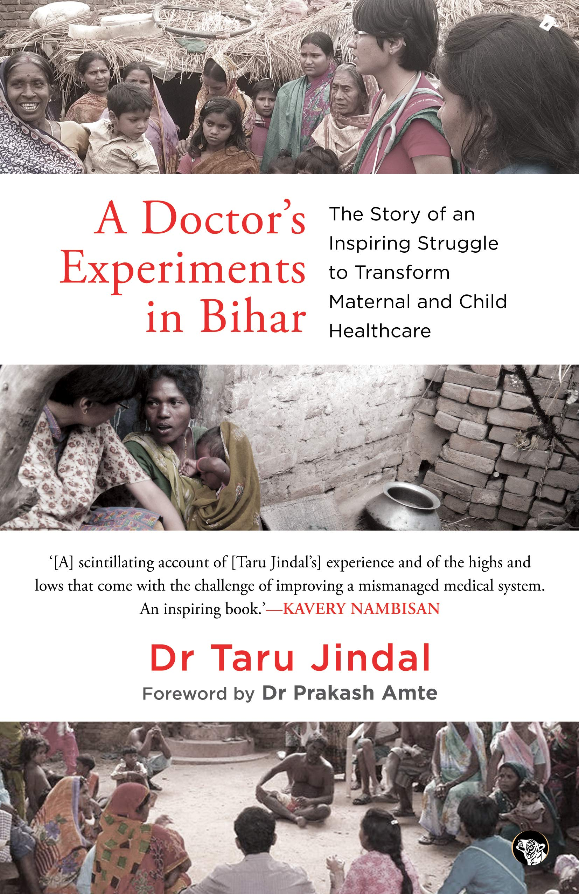

### A small introduction

It is a book about a doctor who had a purpose - to transform maternal and child healthcare in the unserved population of India. After completing her MS in Obstetrics and Gynaecology she decided to work in a district hospital in Bihar and bring transformation there, which she was able to bring after lots of struggle.  She then returned to Mumbai and started as an Assistant Professor in a medical college but her restless desire to work in underserved populations propelled her towards Bihar again - now in a remotest area where no sign of good healthcare care was present. There she struggled much more because being a Gynaecologist she was new as a community healthcare provider. With all ups and downs she managed to provide better healthcare to the community. But after 2 yrs she was diagnosed with Langerhans cell Histiocytosis and had to leave Bihar as she cannot attend clinics anymore. She is currently under treatment for it.

### Reflections 

1. You can't achieve anything if you stay isolated. You have to work with whoever is around you and focus on getting results. 

2. Rapport building with your team is necessary to achieve outcomes. It can be achieved by winning their trust, by building a strong personal connection,  hanging around with them,  knowing all of them by their names, acknowledging them.

3. Every person has a divine spark with them. It is the circumstances which make people cruel, corrupt, negligent or cynical. If given an enabling environment,  everyone would love to be good, do good.  
Any place, any person, no matter how condemned, could change into something fantastic. Whenever we attempt something with a pure heart and intentions,  people will help us. We will be not alone in the quest for change. Circumstances cannot defeat the resilient  spirit. 

4. To make things sustainable every individual in a team should take ownership towards making the change. Participation coming from within  will last long.

5. Understand each individual of your team,  explore what their issues are, what saps their energies. It will help in gaining momentum by directing their energies towards change you want. Wherever we go, there will always be people who will come forward to aid transformation. We just need to sometimes provide the platform and harness their collective energies towards constructive action.

6. Making hasty judgments without having looked at the problem in its entirety is regretted.  
Truth has many facets. Change makers must be open minded and flexible, explore deeply and consider all aspects before reaching conclusions and executing plans.

7. When you truly want something, the whole universe conspires to make it happen.

8. Shram-Daan was her one of initial initiative for change at District Hospital, Motihari.

9. When words don't inspire, work suddenly does.

10. When providing training, mould training according to the level of trainees in local context and their level of understanding.

11. Always have appreciation and acknowledgement for a job well done.

12. As a doctor, I can affect others directly and immediately just by being there with all my skills and all my heart. As doctors, we have lots of respect in people's mind, we have to lead by example. 

13. The way one dies does not matter, what matters is what one did while they lived.

14. Patient is not just her illness, she is a person with a heart and a mind and in addressing just her sickness, I leave a whole lot untreated. 

15. Words have power. Measure the consequences of words before spoken, when to speak, what to speak and most importantly how to speak. 

16. When the administration took an interest, so much could be done, and so fast. Power if used well, could do wonders. 

17. When the existing system changes, some people have to take the heat for it. One can stay and face it bravely if one finds the cause worthwhile, or else quit. If you get scared, they will scare you more. Fear is in the mind, conquer it.

18. Sometimes honest feedback given with due respect works where everything else fails.

19. Change can never be any one person's doing. It requires teamwork. It is not the system which works, it is people who do. It is not the system which fails, it is the people. So, to make the system work, we must focus on influencing people - through improvements of the work environment, emotional and technical support and through appropriate use of authority and rules. We must always attempt change. 

20. Leaders welcome feedback, leaders value people, leaders let others lead too. Help in each other's journey. 

21. If you want to enjoy in life, go to the best place possible, if you want to create in life, go to the worst place possible (where you are needed).

22. When you want change, people initially may reject. But actually they are not rejecting you, they are just acting in accordance with their beliefs. 

23. If we want to stop the dominance of untrained medical practitioners in remote areas, we need to focus on empowering locals with the knowledge and skills required to take care of their own health. 

24. Women are indeed the base of society's pyramid, it is from her that a child sprouts. These children grow up to make nations. A woman weak in her physical, emotional and intellectual health means weak children and ultimately a weak human resource. 

25. When working in very remote areas, utilize every minute of the patient in your hospital (especially women), counsel her, equip her with all the information and knowledge you can.  
Because once she goes back, she may only return to a hospital set up with the next pregnancy. 

26. If you know ''WHY'' you are there, why behind your actions, behind your dreams, you will last - no matter what the challenges. If you are not conscious of your own reasons for doing something, within a few years you will lose steam and tire out.

27. Whenever you start something, always remember the intervention must be simple, sustainable, scalable and replicable.  
Community programmes need to be planned with far-sightedness, with sustainability at the core of it. If we run initiatives mainly based on people borrowed from outside states or cities, there would always be a threat of them leaving midway and jeopardizing the existence of the programme.

28. There is a huge difference between working with the mind and body of one patient versus working with the mind and body of a community. It asked for a different attitude, more patience and much more creativity. 

29. Unless all stakeholders have been involved, consulted and inspired, change will not take off. If by force it does, it will come to a premature halt. 

30. There is always a question about young generations and their priorities. That they are getting increasingly disillusioned about the idea of change, self absorbed and disconnected from the society they live in. But it is also true that their choices and dreams get shaped by the messages the adult society around them generates, through advertising and various other ways. It's our collective responsibility to guide our collective consciousness in healthier directions. With the right opportunities and some guidance, young people can become the best catalysts for change. 

31. Learn to convert your own feeling of outrage into the critical realm of frontline actions. Learn to go beyond the typical inflammatory, knee-jerk reactions towards the ills of our society and the people who perpetuated it. Learn to let go of the finger pointing and work respectfully with the very ones who I believed had deflated the system's tyre. 

32. We must contribute towards society when we are young because in later life we don't have that much energy and are in various tanglement of life. Her TED talk *[At what age should you start the life of contribution?](https://www.youtube.com/watch?v=RRRFK2rgAgQ)* has wonderful insight .

33. It is easy to light a flame, but harder to keep it glowing. 

34. If life takes away one canvas, it gives you another to paint. 

35. If you have done your part right then it doesn't matter what life throws at you, it will be easier to sail through it.
