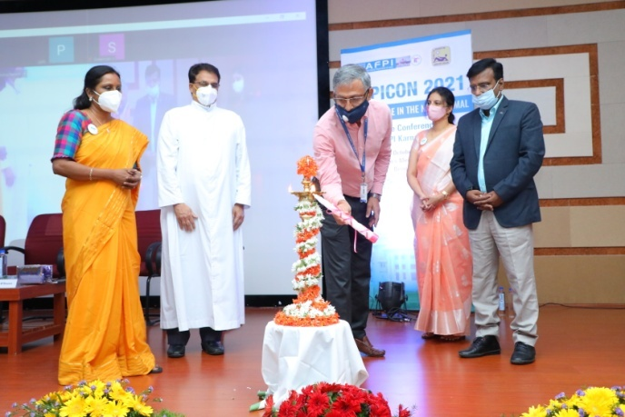

1. Conducted the first CME on “FINANCIAL PRESCRIPTION FOR WEALTH MANAGEMENT” ON 24-2-2021. Ms PREETHI LODAYA – financial advisor and founder – redwood financial Services spoke about the basics of finance management for doctors. The webinar was attended by doctors from India and abroad. Many expressed interest for continued sessions on similar topics in future. 

2. On the International Woman’s’ Day – March 8, 2021, we released a short video on “Menopause – a phase of life” by Dr Swapna Bhaskar on the youtube channel – AFPI KARNATAKA – For public viewing. 

3. The second webinar was conducted on 12 Th March 2021 on the topic – “SWEET PREGNANCY: Case based discussion on gestational diabetes”. Dr Shalini Chandan was the speaker and Dr Anupama Menon moderated the session. 

4. On 21 March 2021- released the next video on – “COVID VACCINES – AWARENESS FOR GENERAL PUBLIC “done by Dr Swapna Bhaskar. The video gathered more than 1.4 k views within a week of release. 

5. Released a short video on World TB day - March 24. The theme of this year was “THE CLOCK IS TICKING, ITS TIME TO END TB”. 

6. Another video on “Right method of using inhalers” by Dr Kritika Ganesh – was released in April on the YouTube channel of AFPI Karnataka.  

7. Webinar on “Medico legal Awareness in the current era” was conducted on 11-6-2021. Eminent medico legal experts Dr Naresh chawla and Dr Divya HM spoke on case based scenarios of general practice and highlighted on the do and don’ts to prevent  and tackle legal issues in practice.  

8. The valedictory function of the second batch of FFM (Fellowship in FM) students from St John’s Medical College was held on August 7 2021. Dr B C Rao, Dr Mohan Kubendra, Dr RK Prasad, Dr John D Souza and other dignitaries presided over the function. The role of AFPI in conducting the program was highly appreciated by the team of St John’s. The importance of FM in the pandemic was stressed upon by the speakers. 

9. THE SECOND STATE CONFERENCE – AFPICON 2021 was held in collaboration with the family medicine dept of St John’s Medical college at the lecture hall – 1, Medical college Building on October 3 , 2021. The theme of the conference was **“NEUROPSYCHAITRY IN POST COVID PRIMARY CARE” and the punch line was “PRIMARY CARE IN THE NEW NORMAL”. It was a unique hybrid conference with more than 200 participants from all over India. Dr Yogesh Jain gave the guest lecture on “Inequity in healthcare during Covid and how family physicians can bridge the gap “. Fr Paul Parathazham - Medical Director of St John’s National Academy of medical sciences , Dr George D Souza- Dean of St John’s Medical College and Dr Raman Kumar – National President AFPI were guest of honour for the inaugural function . 31 posters were presented by delegates and cash prizes were given to winners. The conference also saw active participation from medical students of MSAI and SIMSA – the first of its kind.  

10. The graduation ceremony of the second batch of Primary Health Care Leadership Fellowship by AFPI and Karuna Trust was conducted on 29 October at the Karuna Trust Premises. Five doctors obtained the fellowship this year and the coming year has an enrolment of 7 aspiring primary care physicians. Dr Sudarshan, Dr B C Rao, Dr Swapna Bhaskar, Dr RK Prasad, Dr Soumya Vivek, Dr Jyotika Gupta, Dr Akshay S Dinesh, Dr Dwijavanthi Kumar (online), and Dr Swathi S B (online) presided over the function. AFPI is looking to upscale the program by involving more faculty and continued training in broader aspects of primary care. 

