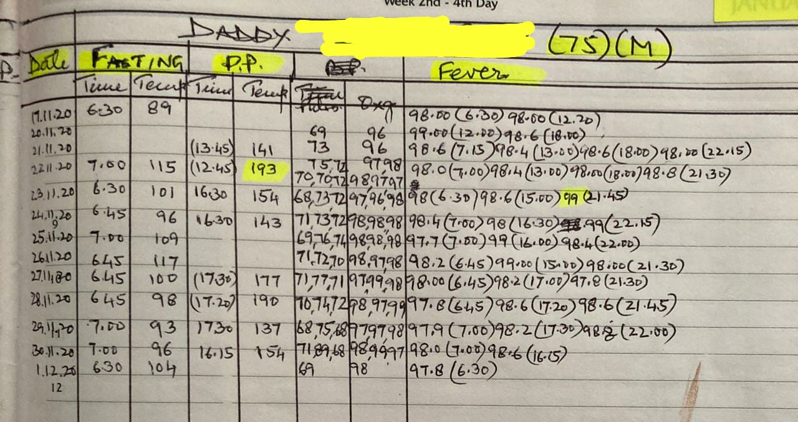
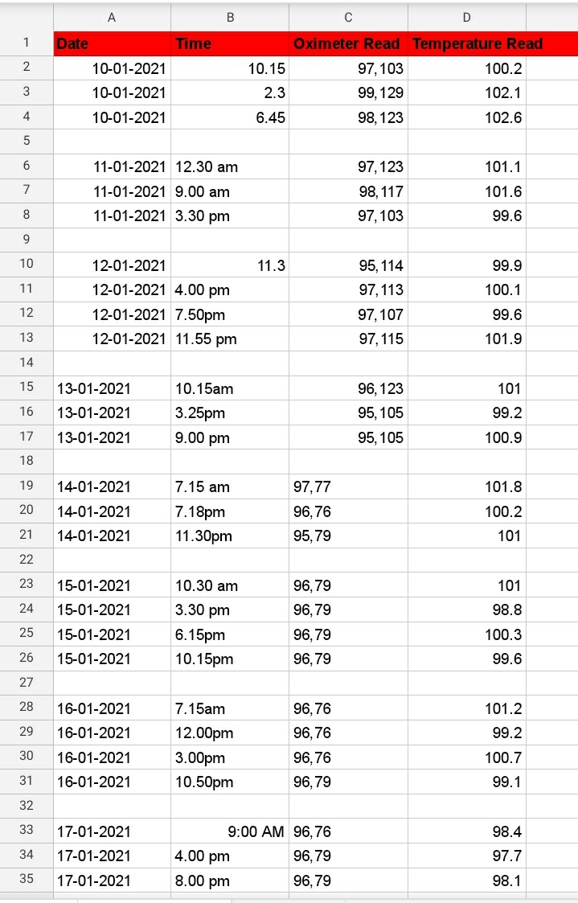

I often ask my patients to record their measurements at home in a diary, and bring them to the next appointment. I find that this improves the self-efficacy of the patients and their family members in taking care of their illnesses, and helps us doctors take better care of them! At the same time it's an ideal, and reality loves to wash away our best laid plans..

Some patients do check their parameters, some don't. Some of those patients who do go to the trouble of measuring them regularly, may not record them! And those who diligently record them may forget to bring those readings when they come for a follow-up consultation! And some of those who keep meticulous records, stop after a few months.

I often tell my patients, "Your proper treatment will only start when you start maintaining a record, till then we're just playing with your illness!" And truly, the home record is vital in adequately managing Hypertension and Diabetes Mellitus, and I've found it useful in other illnesses too, like Typhoid fever, and Food allergies.

I keep wondering how to inspire patients and family members to keep better records. I think I got some answers last year..

All of us battled the pandemic in the last 12 months in our own way. And as we did, we and our patients became more comfortable with and attached to our gadgets. And I'm not just talking about the comfort of attending Zoom meetings in pyjamas! Even taking care of COVID patients at home was different than expected, with technology at our service..

Most patients of COVID-19 recover without any complications. However, some patients, even without co-existing illnesses, do end up getting complications, and such patients can deteriorate very rapidly. So it's vital for the patients or their family members to regularly measure their vital signs, especially temperature and oxygen levels, and share with the doctor once a day.

So, during the first teleconsultation with a patient with a positive COVID test, towards the end I would give them instructions to measure their Temperature, Pulse rate, and SpO2 three times a day, and record them on a piece of paper, and share with me once a day (and report immediately if SpO2 less than 95%). I would also write these instructions in the prescription.

I hoped that since the follow-up was going to happen over WhatsApp chat or video, it would be easier to get to the readings! I took care of about 200 COVID-19 patients, and it was an interesting experience to see the different ways in which they interpreted the above instructions, and followed them, each in their own unique way!

There were of course some patients who steadfastly ignored these instructions, and did not share even a single reading. One patient didn't even buy a Pulse oximeter! Ironically, these were the same patients who got expensive Corona Panel tests done, at the suggestion of family and friends,  and forwarded them to me for interpretation. So probably the cost of the Pulse oximeter was not an issue.

Some others insisted on saying their parameters were normal, and because they were normal they didn't note them down! I wish there was an easy way to explain to such patients why doctors need to see normal figures too, without getting into confidence intervals, trends, high-normal, etc.. I tried telling them that normal figures make doctors happy, please record them for our happiness! This seemed to work for some patients..

To balance out such patients were those who measured their parameters 20-30 times a day, and concernedly reported when the oxygen levels dropped from 98% to 96%, or the heart rate rose from 72 to 84 per minute! Many an hour was spent as a counsellor to listen empathetically, explain gently the normal ranges, and calm down their ruffled feathers..

Now coming to the "normal" minority, who followed the instructions obediently! The records that they shared ranged from too simple to too complicated! Some used paper and sent me screenshots, some sent WhatsApp texts, and one even gave me access to his Google Sheet of vital signs!

Some patients were good at giving structure to their records, noting down the date, the time, the numbers, and the units, one record in one line. If there were multiple family members, each person's name, age and sex was clearly mentioned on top. Enough to bring a tear of joy to the doctor's eye! I happily shared such beautiful records with other patients as examples of how to do this best!

Some patients just sent the numbers, without any date or time, or even whether that 84 on their record was pulse rate or oxygen level! This led to some skipped beats on the part of the doctor, and a call or two to finally clarify, that 84 was indeed the pulse rate and the oxygen level was a very relaxable 98%!

All in all, it was just like asking patients to drink more water or to take frequent breaks from prolonged sitting. Recording and sharing of measurements is just another behaviour change that we want from our patients, and each patient is on their own journey, from Contemplation to Planning to Action and Maintenance. As doctors, all we can do is gently nudge them to the next stage, and build their self-efficacy to avoid relapses and continue the progress!

I would like to believe that with every patient, I learnt something more about record keeping itself, about how to give complicated instructions in simple language, about empathetic counselling, and I feel I am now better equipped to get patients to monitor their health regularly. Of course, I'm sure the next patient will throw up a bigger challenge, as they always do, to keep us always on our toes! 